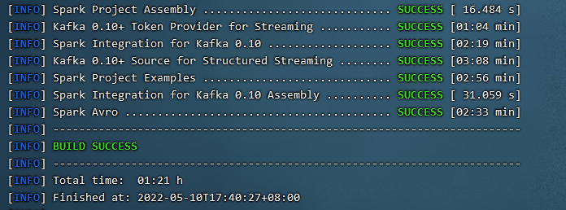

## Antlr4简易快速入门
#### 基本概念
1. 抽象语法树 (Abstract Syntax Tree,AST) 抽象语法树是源代码结构的一种抽象表示，它以树的形状表示语言的语法结构。抽象语法树一般可以用来进行代码语法的检查，代码风格的检查，代码的格式化，代码的高亮，代码的错误提示以及代码的自动补全等等。 
2. 语法解析器 (Parser) 语法解析器通常作为编译器或解释器出现。它的作用是进行语法检查，并构建由输入单词(Token)组成的数据结构(即抽象语法树)。语法解析器通常使用词法分析器(Lexer)从输入字符流中分离出一个个的单词(Token)，并将单词(Token)流作为其输入。实际开发中，语法解析器可以手工编写，也可以使用工具自动生成。
3. 词法分析器 (Lexer) 词法分析是指在计算机科学中，将字符序列转换为单词(Token)的过程。执行词法分析的程序便称为词法分析器。词法分析器(Lexer)一般是用来供语法解析器(Parser)调用的


## 作业一：为 Spark SQL 添加一条自定义命令

* SHOW VERSION；
* 显示当前 Spark 版本和 Java 版本。

1. 在SqlBase.g4中添加语法规则，路径为sql/catalyst/src/main/antlr4/org/apache/spark/sql/catalyst/parser/SqlBase.g4

   ```g4
   statement
   | SHOW VERSION                                                     #showVersion
   ansiNonReserved
   | VERSION
   nonReserved
   | VERSION
   //--SPARK-KEYWORD-LIST-START
   VERSION: 'VERSION';
   ```

2.
新建ShowVersionCommand.scala，路径为sql/core/src/main/scala/org/apache/spark/sql/execution/command/ShowVersionCommand.scala，输出Sprak和Java版本

```scala
package org.apache.spark.sql.execution.command

import org.apache.spark.sql.{Row, SparkSession}
import org.apache.spark.sql.catalyst.expressions.{Attribute, AttributeReference}


import org.apache.spark.sql.types.StringType

/**
 *Show java and spark version
 */
case class ShowVersionCommand() extends LeafRunnableCommand {

    override def output: Seq[Attribute] = Seq(AttributeReference("version", StringType)())

    override def run(sparkSession: SparkSession): Seq[Row] = {
        val sparkVersion = sparkSession.version
        val javaVersion = System.getProperty("java.version")
        val result = String.format("Spark Version: %s, Java Version: %s", sparkVersion, javaVersion)
        Seq(Row(result))
    }
}
```
3. 在SparkSqlParser.scala中添加visitShowVersion方法，并调用ShowVersionCommand
   ```scala
   /**
    * Create a [[ShowVersionCommand]] command.
    */
   override def visitShowVersion(ctx: ShowVersionContext): LogicalPlan = withOrigin(ctx) {
       ShowVersionCommand()
   }
   ```

4. 在idea中编译antlr
   ```mvn antlr4:antlr4```

5. 编译：`mvn clean package -DskipTests -Phive -Phive-thriftserver`
6. 测试运行
   

## 作业二：构建 SQL 满足如下要求

通过 set spark.sql.planChangeLog.level=WARN，查看：

1. 构建一条 SQL，同时 apply 下面三条优化规则：

* CombineFilters: Filter操作合并。针对连续多次Filter进行语义合并，即AND合并。
* CollapseProject: 针对Project操作进行合并。将Project与子Project或子Aggregate进行合并。是一种剪枝操作。
* BooleanSimplification: 简化Boolean表达式，主要是针对Where语句中的And/Or组合逻辑进行优化。

### 创建表

```sql
-- 创建数据库
create database testsql;
use testsql;

-- 创建t_user表
CREATE TABLE t_user(
    id INT,
    sex String,
    age INT,
    occupation INT,
    zipcode String
);
```

### 构建第一条SQL

```sql
select a.id from (select id, age from t_user where age > 18) a where true and age < 30;
```

运行结果截取：

```text
22/05/05 11:36:09 WARN PlanChangeLogger: 
=== Applying Rule org.apache.spark.sql.catalyst.optimizer.PushDownPredicates ===
 Project [id#58]                                                                                                                                                                             Project [id#58]
!+- Filter (true AND (age#60 < 30))                                                                                                                                                          +- Project [id#58, age#60]
!   +- Project [id#58, age#60]                                                                                                                                                                  +- Filter ((age#60 > 18) AND (true AND (age#60 < 30)))
!      +- Filter (age#60 > 18)                                                                                                                                                                     +- HiveTableRelation [`testsql`.`t_user`, org.apache.hadoop.hive.serde2.lazy.LazySimpleSerDe, Data Cols: [id#58, sex#59, age#60, occupation#61, zipcode#62], Partition Cols: []]
!         +- HiveTableRelation [`testsql`.`t_user`, org.apache.hadoop.hive.serde2.lazy.LazySimpleSerDe, Data Cols: [id#58, sex#59, age#60, occupation#61, zipcode#62], Partition Cols: []]   

22/05/05 11:36:09 WARN PlanChangeLogger: 
=== Applying Rule org.apache.spark.sql.catalyst.optimizer.CollapseProject ===
 Project [id#58]                                                                                                                                                                          Project [id#58]
!+- Project [id#58]                                                                                                                                                                       +- Filter ((age#60 > 18) AND (true AND (age#60 < 30)))
!   +- Filter ((age#60 > 18) AND (true AND (age#60 < 30)))                                                                                                                                   +- HiveTableRelation [`testsql`.`t_user`, org.apache.hadoop.hive.serde2.lazy.LazySimpleSerDe, Data Cols: [id#58, sex#59, age#60, occupation#61, zipcode#62], Partition Cols: []]
!      +- HiveTableRelation [`testsql`.`t_user`, org.apache.hadoop.hive.serde2.lazy.LazySimpleSerDe, Data Cols: [id#58, sex#59, age#60, occupation#61, zipcode#62], Partition Cols: []]   
       
22/05/05 11:36:09 WARN PlanChangeLogger: 
=== Applying Rule org.apache.spark.sql.catalyst.optimizer.BooleanSimplification ===
 Project [id#58]                                                                                                                                                                       Project [id#58]
!+- Filter ((age#60 > 18) AND (true AND (age#60 < 30)))                                                                                                                                +- Filter ((age#60 > 18) AND (age#60 < 30))
    +- HiveTableRelation [`testsql`.`t_user`, org.apache.hadoop.hive.serde2.lazy.LazySimpleSerDe, Data Cols: [id#58, sex#59, age#60, occupation#61, zipcode#62], Partition Cols: []]      +- HiveTableRelation [`testsql`.`t_user`, org.apache.hadoop.hive.serde2.lazy.LazySimpleSerDe, Data Cols: [id#58, sex#59, age#60, occupation#61, zipcode#62], Partition Cols: []]
```

完整的运行日志请见[logs/1.log](https://github.com/AlitaIcon/GEEK_HOMEWORK/tree/main/week8/logs/1.log)。

### 构建第二条SQL

2. 构建一条 SQL，同时 apply 下面五条优化规则：

* ConstantFolding: 把可以静态分析出结果的表达式替换成Literal表达式。
* PushDownPredicates: 对于Filter操作，原则上它处于越底层越好，他可以显著减小后面计算的数据量。
* ReplaceDistinctWithAggregate: 用Aggregate来替换Distinct操作，换句话说Distinct操作不会出现在最终的Physical Plan中的。
* ReplaceExceptWithAntiJoin: 用AntiJoin操作来替换“except distinct”操作，注意不针对"except all"。
* FoldablePropagation: 如果可能，将属性替换为原始可折叠表达式的别名

```sql
select a.age from (select age, 1.0 x from t_user where age>20 order by x) a where 1=1 except select age from t_user where age=30;
```

运行结果截取：

```text
22/05/05 17:26:07 WARN PlanChangeLogger: 
=== Applying Rule org.apache.spark.sql.catalyst.optimizer.ReplaceExceptWithAntiJoin ===
!Except false                                                                                                                                                                                      Distinct
!:- Project [age#13]                                                                                                                                                                               +- Join LeftAnti, (age#13 <=> age#18)
!:  +- Filter (1 = 1)                                                                                                                                                                                 :- Project [age#13]
!:     +- Sort [x#10 ASC NULLS FIRST], true                                                                                                                                                           :  +- Filter (1 = 1)
!:        +- Project [age#13, 1.0 AS x#10]                                                                                                                                                            :     +- Sort [x#10 ASC NULLS FIRST], true
!:           +- Filter (age#13 > 20)                                                                                                                                                                  :        +- Project [age#13, 1.0 AS x#10]
!:              +- HiveTableRelation [`testsql`.`t_user`, org.apache.hadoop.hive.serde2.lazy.LazySimpleSerDe, Data Cols: [id#11, sex#12, age#13, occupation#14, zipcode#15], Partition Cols: []]      :           +- Filter (age#13 > 20)
!+- Project [age#18]                                                                                                                                                                                  :              +- HiveTableRelation [`testsql`.`t_user`, org.apache.hadoop.hive.serde2.lazy.LazySimpleSerDe, Data Cols: [id#11, sex#12, age#13, occupation#14, zipcode#15], Partition Cols: []]
!   +- Filter (age#18 = 30)                                                                                                                                                                           +- Project [age#18]
!      +- HiveTableRelation [`testsql`.`t_user`, org.apache.hadoop.hive.serde2.lazy.LazySimpleSerDe, Data Cols: [id#16, sex#17, age#18, occupation#19, zipcode#20], Partition Cols: []]                  +- Filter (age#18 = 30)
!                                                                                                                                                                                                           +- HiveTableRelation [`testsql`.`t_user`, org.apache.hadoop.hive.serde2.lazy.LazySimpleSerDe, Data Cols: [id#16, sex#17, age#18, occupation#19, zipcode#20], Partition Cols: []]
           
22/05/05 17:26:07 WARN PlanChangeLogger: 
=== Applying Rule org.apache.spark.sql.catalyst.optimizer.ReplaceDistinctWithAggregate ===
!Distinct                                                                                                                                                                                             Aggregate [age#13], [age#13]
 +- Join LeftAnti, (age#13 <=> age#18)                                                                                                                                                                +- Join LeftAnti, (age#13 <=> age#18)
    :- Project [age#13]                                                                                                                                                                                  :- Project [age#13]
    :  +- Filter (1 = 1)                                                                                                                                                                                 :  +- Filter (1 = 1)
    :     +- Sort [x#10 ASC NULLS FIRST], true                                                                                                                                                           :     +- Sort [x#10 ASC NULLS FIRST], true
    :        +- Project [age#13, 1.0 AS x#10]                                                                                                                                                            :        +- Project [age#13, 1.0 AS x#10]
    :           +- Filter (age#13 > 20)                                                                                                                                                                  :           +- Filter (age#13 > 20)
    :              +- HiveTableRelation [`testsql`.`t_user`, org.apache.hadoop.hive.serde2.lazy.LazySimpleSerDe, Data Cols: [id#11, sex#12, age#13, occupation#14, zipcode#15], Partition Cols: []]      :              +- HiveTableRelation [`testsql`.`t_user`, org.apache.hadoop.hive.serde2.lazy.LazySimpleSerDe, Data Cols: [id#11, sex#12, age#13, occupation#14, zipcode#15], Partition Cols: []]
    +- Project [age#18]                                                                                                                                                                                  +- Project [age#18]
       +- Filter (age#18 = 30)                                                                                                                                                                              +- Filter (age#18 = 30)
          +- HiveTableRelation [`testsql`.`t_user`, org.apache.hadoop.hive.serde2.lazy.LazySimpleSerDe, Data Cols: [id#16, sex#17, age#18, occupation#19, zipcode#20], Partition Cols: []]                     +- HiveTableRelation [`testsql`.`t_user`, org.apache.hadoop.hive.serde2.lazy.LazySimpleSerDe, Data Cols: [id#16, sex#17, age#18, occupation#19, zipcode#20], Partition Cols: []]

22/05/05 17:26:07 WARN PlanChangeLogger: 
=== Applying Rule org.apache.spark.sql.catalyst.optimizer.PushDownPredicates ===
 Aggregate [age#13], [age#13]                                                                                                                                                                         Aggregate [age#13], [age#13]
 +- Join LeftAnti, (age#13 <=> age#18)                                                                                                                                                                +- Join LeftAnti, (age#13 <=> age#18)
    :- Project [age#13]                                                                                                                                                                                  :- Project [age#13]
!   :  +- Filter (1 = 1)                                                                                                                                                                                 :  +- Sort [x#10 ASC NULLS FIRST], true
!   :     +- Sort [x#10 ASC NULLS FIRST], true                                                                                                                                                           :     +- Project [age#13, 1.0 AS x#10]
!   :        +- Project [age#13, 1.0 AS x#10]                                                                                                                                                            :        +- Filter ((age#13 > 20) AND (1 = 1))
!   :           +- Filter (age#13 > 20)                                                                                                                                                                  :           +- HiveTableRelation [`testsql`.`t_user`, org.apache.hadoop.hive.serde2.lazy.LazySimpleSerDe, Data Cols: [id#11, sex#12, age#13, occupation#14, zipcode#15], Partition Cols: []]
!   :              +- HiveTableRelation [`testsql`.`t_user`, org.apache.hadoop.hive.serde2.lazy.LazySimpleSerDe, Data Cols: [id#11, sex#12, age#13, occupation#14, zipcode#15], Partition Cols: []]      +- Project [age#18]
!   +- Project [age#18]                                                                                                                                                                                     +- Filter (age#18 = 30)
!      +- Filter (age#18 = 30)                                                                                                                                                                                 +- HiveTableRelation [`testsql`.`t_user`, org.apache.hadoop.hive.serde2.lazy.LazySimpleSerDe, Data Cols: [id#16, sex#17, age#18, occupation#19, zipcode#20], Partition Cols: []]
!         +- HiveTableRelation [`testsql`.`t_user`, org.apache.hadoop.hive.serde2.lazy.LazySimpleSerDe, Data Cols: [id#16, sex#17, age#18, occupation#19, zipcode#20], Partition Cols: []]            

22/05/05 17:26:07 WARN PlanChangeLogger: 
=== Applying Rule org.apache.spark.sql.catalyst.optimizer.FoldablePropagation ===
 Aggregate [age#13], [age#13]                                                                                                                                                                         Aggregate [age#13], [age#13]
 +- Project [age#13]                                                                                                                                                                                  +- Project [age#13]
!   +- Sort [x#10 ASC NULLS FIRST], true                                                                                                                                                                 +- Sort [1.0 ASC NULLS FIRST], true
       +- Project [age#13, 1.0 AS x#10]                                                                                                                                                                     +- Project [age#13, 1.0 AS x#10]
          +- Join LeftAnti, (age#13 <=> age#18)                                                                                                                                                                +- Join LeftAnti, (age#13 <=> age#18)
             :- Project [age#13]                                                                                                                                                                                  :- Project [age#13]
             :  +- Filter ((age#13 > 20) AND (1 = 1))                                                                                                                                                             :  +- Filter ((age#13 > 20) AND (1 = 1))
             :     +- HiveTableRelation [`testsql`.`t_user`, org.apache.hadoop.hive.serde2.lazy.LazySimpleSerDe, Data Cols: [id#11, sex#12, age#13, occupation#14, zipcode#15], Partition Cols: []]               :     +- HiveTableRelation [`testsql`.`t_user`, org.apache.hadoop.hive.serde2.lazy.LazySimpleSerDe, Data Cols: [id#11, sex#12, age#13, occupation#14, zipcode#15], Partition Cols: []]
             +- Project [age#18]                                                                                                                                                                                  +- Project [age#18]
                +- Filter (age#18 = 30)                                                                                                                                                                              +- Filter (age#18 = 30)
                   +- HiveTableRelation [`testsql`.`t_user`, org.apache.hadoop.hive.serde2.lazy.LazySimpleSerDe, Data Cols: [id#16, sex#17, age#18, occupation#19, zipcode#20], Partition Cols: []]                     +- HiveTableRelation [`testsql`.`t_user`, org.apache.hadoop.hive.serde2.lazy.LazySimpleSerDe, Data Cols: [id#16, sex#17, age#18, occupation#19, zipcode#20], Partition Cols: []]

22/05/05 17:26:07 WARN PlanChangeLogger: 
=== Applying Rule org.apache.spark.sql.catalyst.optimizer.ConstantFolding ===
 Aggregate [age#13], [age#13]                                                                                                                                                                         Aggregate [age#13], [age#13]
 +- Project [age#13]                                                                                                                                                                                  +- Project [age#13]
    +- Sort [1.0 ASC NULLS FIRST], true                                                                                                                                                                  +- Sort [1.0 ASC NULLS FIRST], true
       +- Project [age#13, 1.0 AS x#10]                                                                                                                                                                     +- Project [age#13, 1.0 AS x#10]
          +- Join LeftAnti, (age#13 <=> age#18)                                                                                                                                                                +- Join LeftAnti, (age#13 <=> age#18)
             :- Project [age#13]                                                                                                                                                                                  :- Project [age#13]
!            :  +- Filter ((age#13 > 20) AND (1 = 1))                                                                                                                                                             :  +- Filter ((age#13 > 20) AND true)
             :     +- HiveTableRelation [`testsql`.`t_user`, org.apache.hadoop.hive.serde2.lazy.LazySimpleSerDe, Data Cols: [id#11, sex#12, age#13, occupation#14, zipcode#15], Partition Cols: []]               :     +- HiveTableRelation [`testsql`.`t_user`, org.apache.hadoop.hive.serde2.lazy.LazySimpleSerDe, Data Cols: [id#11, sex#12, age#13, occupation#14, zipcode#15], Partition Cols: []]
             +- Project [age#18]                                                                                                                                                                                  +- Project [age#18]
                +- Filter (age#18 = 30)                                                                                                                                                                              +- Filter (age#18 = 30)
                   +- HiveTableRelation [`testsql`.`t_user`, org.apache.hadoop.hive.serde2.lazy.LazySimpleSerDe, Data Cols: [id#16, sex#17, age#18, occupation#19, zipcode#20], Partition Cols: []]                     +- HiveTableRelation [`testsql`.`t_user`, org.apache.hadoop.hive.serde2.lazy.LazySimpleSerDe, Data Cols: [id#16, sex#17, age#18, occupation#19, zipcode#20], Partition Cols: []]
```

完整的运行日志请见[logs/2.log](https://github.com/AlitaIcon/GEEK_HOMEWORK/tree/main/week8/logs/2.log)。

> 参考链接：
> * spark-catalyst-optimizer: https://github.com/ColZer/DigAndBuried/blob/master/spark/spark-catalyst-optimizer.md

## 作业三：实现自定义优化规则（静默规则）

1. 第一步：实现自定义规则，对字段乘以整数1或者小数形式的1进行优化
```scala
package org.example

import org.apache.spark.sql.SparkSession
import org.apache.spark.sql.catalyst.expressions.{Expression, Literal, Multiply}
import org.apache.spark.sql.catalyst.plans.logical.LogicalPlan
import org.apache.spark.sql.catalyst.rules.Rule
import org.apache.spark.sql.types.Decimal

case class MultiplyOptimizationRule(spark: SparkSession) extends Rule[LogicalPlan] {

    override def apply(plan: LogicalPlan): LogicalPlan = plan transformAllExpressions {
        case Multiply(left, right, _) if isOne(right) =>
            logWarning("Right is one, MultiplyOptimizationRule take effect")
            left
            case Multiply(left, right, _) if isOne(left) =>
            logWarning("Left is one, MultiplyOptimizationRule take effect")
            right
        }

    // 判断是否为整数1或者小数的1
    def isOne(expression: Expression): Boolean = {
        expression.isInstanceOf[Literal] &&
        ((expression.asInstanceOf[Literal].value.isInstanceOf[Int] && expression.asInstanceOf[Literal].value.asInstanceOf[Int] == 1)
        || (expression.asInstanceOf[Literal].value.isInstanceOf[Decimal] && expression.asInstanceOf[Literal].value.asInstanceOf[Decimal].toDouble == 1.0))
        }
}
```
2. 第二步：创建自己的 Extension 并注入
    ```scala
    package org.example

    import org.apache.spark.sql.SparkSessionExtensions

    class MySparkSessionExtensions extends (SparkSessionExtensions => Unit) {
    override def apply(extensions: SparkSessionExtensions): Unit = {
        extensions.injectOptimizerRule {
        session => MultiplyOptimizationRule(session);
        }
    }
    }
    ```
3. 第三步：通过 spark.sql.extensions 提交
    ```bash
    ./bin/spark-sql --jars /work/projects/bigdata/sparksql/target/spark-extension-1.0-SNAPSHOT.jar --conf spark.sql.extensions=org.example.MySparkSessionExtension
    ```
   通过sql语句`select id * 1 from t_user;`测试结果如下：
    ```text
    22/05/06 16:27:10 WARN MultiplyOptimizationRule: Right is one, MultiplyOptimizationRule take effect
    22/05/06 16:27:10 WARN PlanChangeLogger: 
    === Applying Rule org.example.MultiplyOptimizationRule ===
    !Project [(id#10 * 1) AS (id * 1)#15]                                                                                                                                               Project [id#10 AS (id * 1)#15]
    +- HiveTableRelation [`testsql`.`t_user`, org.apache.hadoop.hive.serde2.lazy.LazySimpleSerDe, Data Cols: [id#10, sex#11, age#12, occupation#13, zipcode#14], Partition Cols: []]   +- HiveTableRelation [`testsql`.`t_user`, org.apache.hadoop.hive.serde2.lazy.LazySimpleSerDe, Data Cols: [id#10, sex#11, age#12, occupation#13, zipcode#14], Partition Cols: []]
    ```
   通过sql语句`select id * 1.0 from t_user;`测试结果如下：
    ```text
    22/05/06 16:27:50 WARN MultiplyOptimizationRule: Right is one, MultiplyOptimizationRule take effect
    22/05/06 16:27:50 WARN PlanChangeLogger: 
    === Applying Rule org.example.MultiplyOptimizationRule ===
    !Project [CheckOverflow((promote_precision(cast(cast(id#17 as decimal(10,0)) as decimal(11,1))) * 1.0), DecimalType(13,1), true) AS (id * 1.0)#22]                                  Project [CheckOverflow(promote_precision(cast(cast(id#17 as decimal(10,0)) as decimal(11,1))), DecimalType(13,1), true) AS (id * 1.0)#22]
    +- HiveTableRelation [`testsql`.`t_user`, org.apache.hadoop.hive.serde2.lazy.LazySimpleSerDe, Data Cols: [id#17, sex#18, age#19, occupation#20, zipcode#21], Partition Cols: []]   +- HiveTableRelation [`testsql`.`t_user`, org.apache.hadoop.hive.serde2.lazy.LazySimpleSerDe, Data Cols: [id#17, sex#18, age#19, occupation#20, zipcode#21], Partition Cols: []]
    ```
   完整的运行日志请见[logs/3.log](https://github.com/AlitaIcon/GEEK_HOMEWORK/tree/main/week8/logs/3.log)。