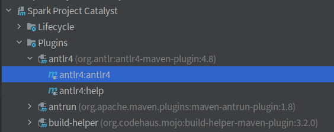
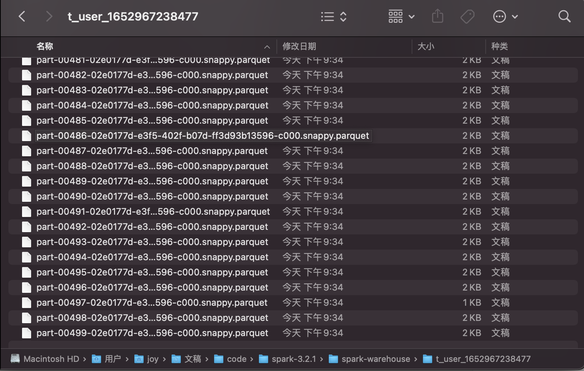
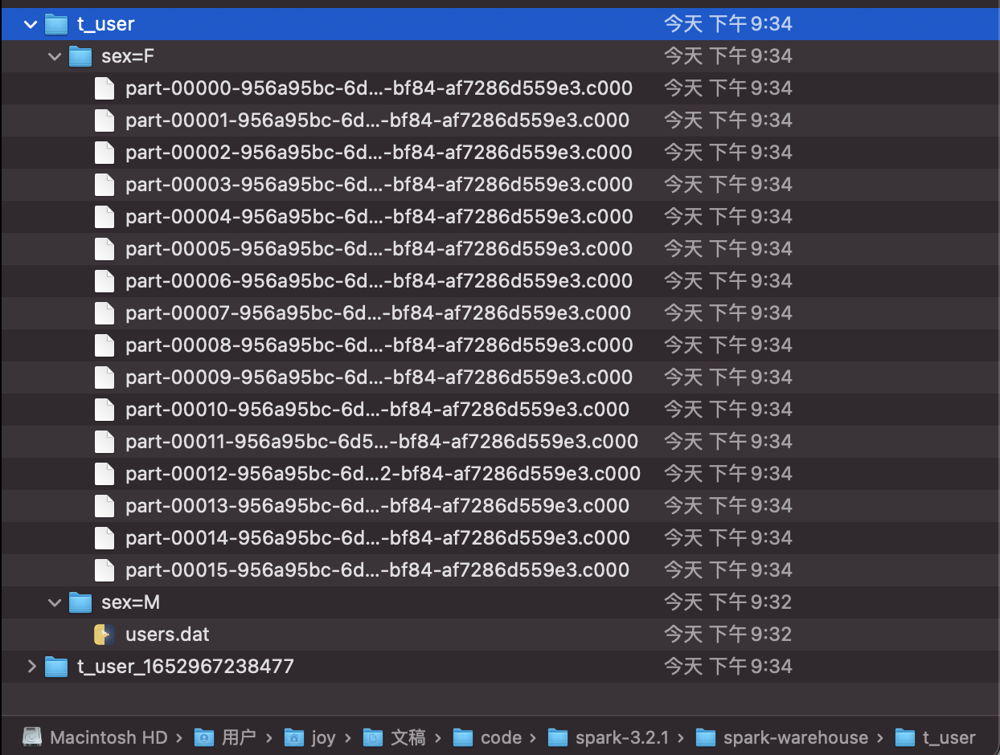
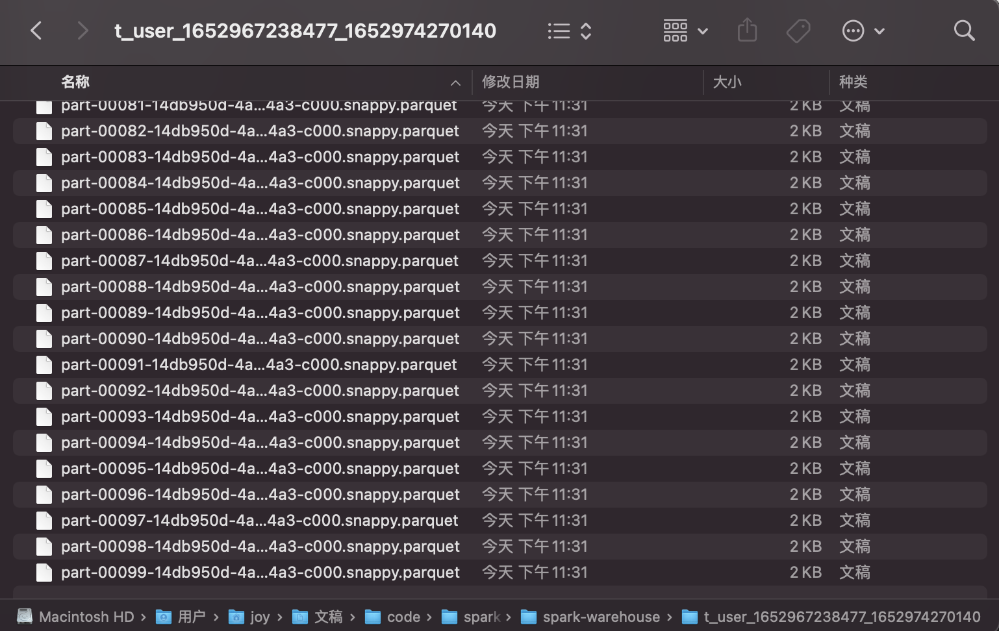
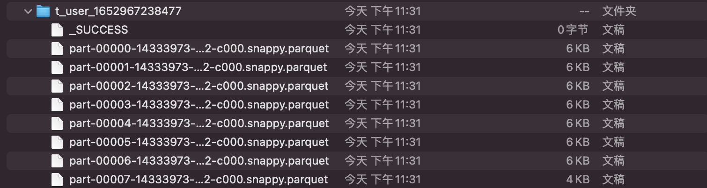

## 实现 Compact table command

1. 要求：
   添加 compact table 命令，用于合并小文件，例如表 test1 总共有 50000 个文件，每个 1MB，通过该命令，合成为 500 个文件，每个约 100MB。
2. 语法：
   COMPACT TABLE table_identify [partitionSpec] [INTO fileNum FILES]；
3. 说明：
    * 基本要求是完成以下功能：COMPACT TABLE test1 INTO 500 FILES；
    * 如果添加 partitionSpec，则只合并指定的 partition 目录的文件；
    * 如果不加 into fileNum files，则把表中的文件合并成 128MB 大小。

**作业实现**

1. 在SqlBase.g4中添加语法规则，路径为sql/catalyst/src/main/antlr4/org/apache/spark/sql/catalyst/parser/SqlBase.g4
    ```g4
    statement
    | COMPACT TABLE target=tableIdentifier partitionSpec?
        (INTO fileNum=INTEGER_VALUE FILES)?                            #compactTable
    ansiNonReserved
    | FILES
    nonReserved
    | FILES
    //--SPARK-KEYWORD-LIST-START
    FILES: 'FILES';
    ```

2. 在idea中编译antlr
   

3. 新建CompactTableCommand.scala，路径为sql/core/src/main/scala/org/apache/spark/sql/execution/command/CompactTableCommand.scala
    ```scala
    package org.apache.spark.sql.execution.command
    
    import org.apache.spark.sql.{Row, SaveMode, SparkSession}
    import org.apache.spark.sql.catalyst.TableIdentifier
    import org.apache.spark.sql.catalyst.expressions.{Attribute, AttributeReference}
    import org.apache.spark.sql.types.StringType
    
    case class CompactTableCommand(table: TableIdentifier,
                                   fileNum: Option[Int],
                                   partitionSpec: Option[String]) extends LeafRunnableCommand {
    
      private val defaultSize = 128 * 1024 * 1024
    
      override def output: Seq[Attribute] = Seq(
        AttributeReference("compact", StringType, nullable = false)()
      )
    
      override def run(sparkSession: SparkSession): Seq[Row] = {
        // 设置当前数据库
        sparkSession.catalog.setCurrentDatabase(table.database.getOrElse("default"))
        // 临时表格式：curTable_timestamp
        val tempTableName = "`" + table.identifier + "_" + System.currentTimeMillis() + "`"
    
        val originDataFrame = sparkSession.table(table.identifier)
        // 计算分区数，如果fileNum有效，则为fileNum，否则使用默认分区大小128M计算分区数
        val partitions = fileNum match {
          case Some(num) => num
          case None => (sparkSession.sessionState
            .executePlan(originDataFrame.queryExecution.logical)
            .optimizedPlan.stats.sizeInBytes / defaultSize).toInt + 1
        }
    
        if (partitionSpec.nonEmpty) {
          // 如果不更改这个参数，使用默认的static，在动态插入时，不管插入的分区是否存在，都会导致所有的分区被覆盖，数据无法找回
          sparkSession.conf.set("spark.sql.sources.partitionOverwriteMode", "dynamic")
          // Dynamic partition strict mode requires at least one static partition column.
          // To turn this off set hive.exec.dynamic.partition.mode=nonstrict
          sparkSession.conf.set("hive.exec.dynamic.partition.mode", "nonstrict")
    
          // 当partitionSpec有值时，partition(key1=value1,key2=value2)转换为key1=value1 AND key2=value2的条件语句
          val conditionExpr = partitionSpec.get.trim
            .stripPrefix("partition(").dropRight(1)
            .replace(",", " AND ")
    
          // 设置分区数及where条件将数据写入临时表中
          originDataFrame
            .where(conditionExpr)
            .repartition(partitions)
            .write.mode(SaveMode.Overwrite)
            .saveAsTable(tempTableName)
    
          // 将临时表中的数据重新插入到原表中
          sparkSession
            .table(tempTableName)
            .write.mode(SaveMode.Overwrite)
            .insertInto(table.identifier)
        } else {
          // 当partitionSpec不存在时，设置分区数将数据读取到临时表中
          originDataFrame
            .repartition(partitions)
            .write
            .mode(SaveMode.Overwrite)
            .saveAsTable(tempTableName)
    
          // 读取临时表，对原表进行覆盖
          sparkSession.table(tempTableName)
            .write
            .mode(SaveMode.Overwrite)
            .saveAsTable(table.identifier)
        }
    
        // 删除临时表，此处不删除用于查看分区效果
        // sparkSession.sql(s"DROP TABLE ${tempTableName}")
    
        Seq(Row(s"compact table ${table.identifier} finished."))
      }
    }
    ```

4. 在SparkSqlParser.scala中添加visitCompactTable方法，并调用CompactTableCommand
    ```scala
    override def visitCompactTable(ctx: CompactTableContext): LogicalPlan = withOrigin(ctx) {
      val table: TableIdentifier = visitTableIdentifier(ctx.tableIdentifier())
      // 解析获得文件数
      val fileNum: Option[Int] = if (ctx.INTEGER_VALUE() != null) {
        Some(ctx.INTEGER_VALUE().getText.toInt)
      } else {
        None
      }
      // 解析获得partitionSpec, 格式partition(key1=value1,key2=value2)
      val partition: Option[String] = if (ctx.partitionSpec() != null) {
        Some(ctx.partitionSpec().getText)
      } else {
        None
      }
      CompactTableCommand(table, fileNum, partition);
    } 
    ```

5. 编译：`./build/mvn clean package -DskipTests -Phive -Phive-thriftserver`

6. 测试运行

   创建测试表并导入数据

    ```sql
    CREATE TABLE t_user(
      id INT,
      age INT,
      occupation INT,
      zipcode String
    ) PARTITIONED BY (sex String) 
    row format delimited fields terminated by ',' 
    stored as textfile;
    
    load data local inpath '/Users/joy/Downloads/user/M' into table t_user partition(sex='M');
    load data local inpath '/Users/joy/Downloads/user/F' into table t_user partition(sex='F');
    ```

   在spark-sql命令行中执行COMPACT TABLE命令:

    ```sql
    COMPACT TABLE t_user partition(sex='F') INTO 500 FILES;
    ```

   命令执行后会生成一个临时表t_user_1652967238477，可以在spark-warehouse目录下看到该表有500个分块:

   

   同时t_user表中sex=F分区也重新进行了分块：

   			
   再次执行compact将临时表t_user_1652967238477的500小文件进行合并：

   ```sql
   COMPACT TABLE t_user_1652967238477 INTO 100 FILES;
   ```

   新生成一个临时表t_user_1652967238477_1652974270140，被分成100块：

   

   同时t_user_1652967238477表中原来的500个小文件也被重新合并：

   		